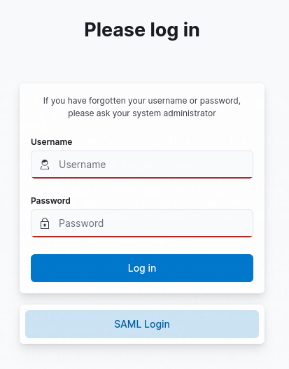

<!---
Copyright 2022 floragunn GmbH
-->

# Using Multiple Authentication Methods for Kibana

In some cases you might need to offer more than one authentication method to the users which access your Kibana installation.

There are two approaches to this:

* Search Guard displays a list of available authentication methods on the login page. The user can then choose the appropriate login method.
* You run several Kibana instances, each configured with a different login method. Users which open the URL of the respective Kibana instance in their browser, will be automatically presented with the configured login method.

## Several Authentication Methods in one Kibana Instance

Configuring more than one authentication method for Kibana is straight forward: The  `sg_frontend_authc.yml` configuration allows to configure more than one login method at once. 

This might then look like this:

```yaml
default:
  auth_domains:
  - type: basic
  - type: saml
    label: "SAML Login"
    saml.idp.metadata_url: "http://your.idp/auth/realms/master/protocol/saml/descriptor"
    saml.idp.entity_id: "IdP entity id from the IdP"
    saml.sp.entity_id: "SP entity id from the IdP"
```

The resulting login screen will then look like this:



You can also configure several `auth_domains` entries using the same type. So, you can support several IdPs at once. Use the `label` attribute of each entry to give the user a short hint what authentication method is configured here. The value of the `label` attribute will be displayed on the button that links to the IdP.

## Setting a default authentication method

**Introduced in Search Guard FLX 1.2**

If you have multiple authentication methods and you want to designate one of them as the default method presented to users, you can use the `auto_select: true` property.

This feature is useful when you have a preferred authentication method that should be used most of the time, but you still want to keep others as fallback or emergency options.

To configure the default authentication method, include `auto_select: true` property to your method in `sg_frontend_authc.yml` as in this example:

```yaml
default:
  auth_domains:
  - type: basic
  - type: saml
    label: "SAML Login"
    auto_select: true
    saml.idp.metadata_url: "http://your.idp/auth/realms/master/protocol/saml/descriptor"
    saml.idp.entity_id: "IdP entity id from the IdP"
    saml.sp.entity_id: "SP entity id from the IdP"
  - type: "oidc"
    id: "oidc_optional"
    label: "OIDC Login"
    oidc.client_id: "Client id from the IdP"
    oidc.client_secret: "Client secret from the IdP"
    oidc.idp.openid_configuration_url: "http://your.id/realms/master/.well-known/openid-configuration"
    user_mapping.roles.from: "oidc_id_token.roles"

```

When an unauthenticated user enters Kibana or logs out, they will be automatically redirected to SAML login.

All other methods can be still visible if a user enters `/login` page. They can also be accessed with their respective URLs by `id`. In our example: `/auth/oidc/login?authTypeId=oidc_optional`.

Only one endpoint per instance can be marked with `auto_select: true`.
{: .note .js-note .note-warning}

## Direct access to the authentication method

Search Guard provides a number of defined endpoints to directly access individual authentication methods. You can use these endpoints to override the `auto_select` setting or to skip the standard login page. 

The endpoints are the following:

- `basic` authentication: `https://your-kibana-instance/login` on Elasticsearch 7.x and `https://your-kibana-instance/searchguard/login` on Elasticsearch 8.x. Note: This also includes links to other auth methods if configured.
- `saml` authentication: `https://your-kibana-instance/auth/saml/login`. If you have more than one SAML `auth_domain` configured, you need to give each auth domain an explicit ID (see below) and reference that in the endpoint with `https://your-kibana-instance/auth/saml/login?authTypeId={id}`.
- `oidc` authentication: `https://your-kibana-instance/auth/openid/login`. If you have more than one OIDC `auth_domain` configured, you need to give each auth domain an explicit ID (see below) and reference that in the endpoint with `https://your-kibana-instance/auth/openid/login?authTypeId={id}`.

### Giving an authentication method an explicit ID

In the case that you are using several auth domains with the same type, you need to identify each auth domain with an explicit ID in order to reference it using one of the links described above. Use the `id` attribute for this. This might look like this:


```yaml
default:
  auth_domains:
  - type: basic
  - type: saml
    id: your_saml_idp_1
    label: "SAML Login"
    saml.idp.metadata_url: "http://your.idp/auth/realms/master/protocol/saml/descriptor"
    saml.idp.entity_id: "IdP entity id from the IdP"
    saml.sp.entity_id: "SP entity id from the IdP"
  - type: saml
    id: your_saml_idp_2
    label: "SAML Login"
    saml.idp.metadata_url: "http://your.other.idp/auth/realms/master/protocol/saml/descriptor"
    saml.idp.entity_id: "IdP entity id from the IdP"
    saml.sp.entity_id: "SP entity id from the IdP"    
```

Now the two methods can be accessed with `/auth/saml/login?authTypeId=your_saml_idp_1`, respectively `/auth/saml/login?authTypeId=your_saml_idp_2`.

When `id` is not provided, the domain will receive a hashed hex value (like `ed017b18`). This value may be regenerated during configuration change, so do not leave `id` blank if you wish to provide users with a consistent URL to your method.
{: .note .js-note .note-warning}

## Running Several Kibana Instances

If you are running several instances of Kibana, you can assign each Kibana instance a different authentication configuration.

To achieve this, the `sg_frontend_authc.yml` configuration file allows you to specify additional configuration entries, besides the usually existing `default` entry.

So, you can have your `sg_frontend_authc.yml` like this:

```yaml
default:
  auth_domains:
  - type: basic
another_instance:
  auth_domains:  
  - type: saml
    idp.metadata_url: "http://your.idp/auth/realms/master/protocol/saml/descriptor"
    idp.entity_id: "IdP entity id from the IdP"
    sp.entity_id: "SP entity id from the IdP"
    roles_key: "roles"    
```

On the Kibana instance, which is supposed to use SAML authentication, edit the file `config/kibana.yml` and add this line:

```yaml
searchguard.sg_frontend_config_id: another_instance
```

This makes the Kibana instance use the configuration entry `another_instance` in  `sg_frontend_authc.yml`.

In order to activate the changes, do not forget to upload `sg_frontend_authc.yml` and restart the particular Kibana instance afterwards. 
